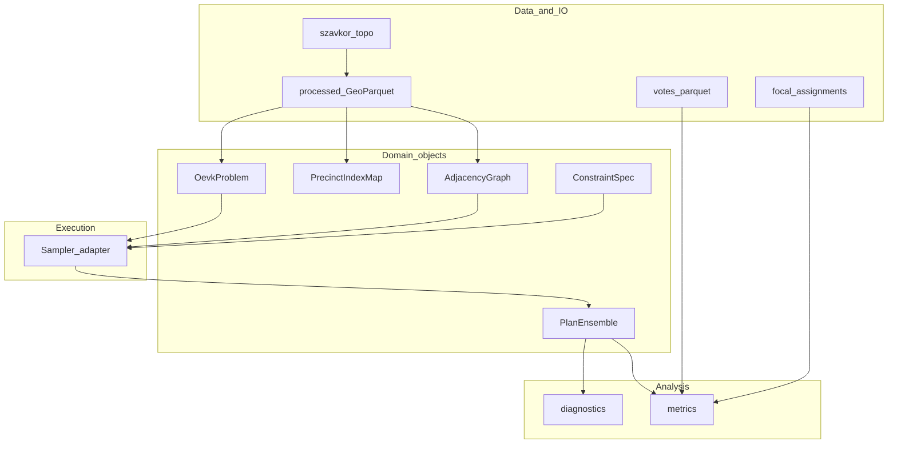
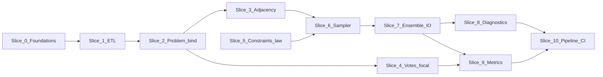

# Master implementation plan

This document is the **roadmap** for taking the Hungary OEVK ensemble project from scaffolded `hungary_ge` to end-to-end analysis. It is organized into **slices** that can each be turned into a focused sub-plan (ticket, PR description, or Cursor plan). For ALARM and `redist` concepts, see [alarm-methodology.md](alarm-methodology.md); for data contracts, see [data-model.md](data-model.md); for ensemble framing, see [methodology.md](methodology.md).

---

## 1. North-star outcomes

| Outcome | Measurable criterion |
|---------|----------------------|
| **Canonical spatial layer** | Single authoritative precinct polygon layer under `data/processed/`, with stable `precinct_id` (`maz-taz-szk`), documented CRS, reproducible build from `szavkor_topo`. |
| **Graph** | Contiguity (queen/rook) adjacency for all precincts consistent with that layer; optional manual edge list for known geographic fixes. |
| **Electoral join** | Precinct-level (or aggregated) votes and population joined on `precinct_id`; **enacted** OEVK labels for **106** districts available for focal comparison. |
| **Constraint spec** | Written-down Hungarian rules encoded as **hard** vs **soft** constraints (see ALARM distinction in [alarm-methodology.md](alarm-methodology.md)); versioned in repo. |
| **Ensemble** | On the order of **10,000** plausible plans (or defensible smaller pilot with documented SE), stored with metadata (seed, run id, software versions). |
| **Diagnostics** | Evidence that the sampler explores the constrained space (ESS, split stats, cross-run checks as appropriate for SMC/MCMC). |
| **Metrics** | Distributions of **partisan** summaries (seats–votes, efficiency gap, symmetry-style) with **focal plan percentile / tail placement**; compactness secondary. |

**Non-goals for v1 (unless explicitly expanded):** Perfect legal replication of every statutory nuance without sources; U.S.-only `alarmdata` assumptions; treating compactness as primary fairness evidence.

---

## 2. Architecture and OO structure

### 2.1 Design principles

1. **Pipeline-aligned packages** — Keep [`src/hungary_ge/`](../src/hungary_ge/) submodules mapped to ALARM stages (`io` → `problem` → `graph` → `constraints` / `sampling` → `ensemble` → `diagnostics` / `metrics`). Avoid a “god object” that does I/O, sampling, and plotting.

2. **Thin domain types, rich functions** — Prefer **immutable or frozen dataclasses** for specs (`OevkProblem`, constraint bundles, `PlanEnsemble`) and **pure functions** for transforms (metrics, validation, aggregation). Use **classes** when you need identity + mutable state (e.g. a live R session handle) or complex invariants (`PlanEnsemble` row/column validation).

3. **Protocol / ABC only when multiple backends exist** — Introduce `Sampler`/`RedistrictingBackend` abstractions **after** you have two implementations (e.g. R `redist` subprocess vs future Python). Until then, a single `sample_plans` with an explicit `backend=` string or config object avoids premature abstraction.

4. **Separate “geospatial truth” from “solver graph”** — GeoPandas holds geometries; the sampler may consume **integer node indices** and an **edge list** or **sparse adjacency**. Provide a typed mapping (`PrecinctIndexMap`: `precinct_id ⟷ row index`) to prevent silent reorder bugs.

5. **Serialization at boundaries** — Anything that crosses R, disk, or notebooks should have a **defined schema** (GeoJSON properties, parquet column names, JSON manifest for ensemble runs). Internal Python objects stay private unless exported in `hungary_ge.__init__`.

6. **Hungarian IDs in public API** — Keep `maz`, `taz`, `szk`, composite `precinct_id`, and `ndists=106` in user-facing names; use “redist_map / redist_plans” only in docstrings for ALARM analogy.

### 2.2 Conceptual layers



### 2.3 Types to introduce over time (suggested names)

| Type / module | Responsibility |
|---------------|----------------|
| `OevkProblem` (exists) | District count, column name contract, `pop_tol`, CRS. **Extend** with optional references to artifact paths or checksums, not huge in-memory data. |
| `PrecinctIndexMap` (new) | Ordered `precinct_id` list, `to_index`, `to_id`, stable sort contract. |
| `AdjacencyGraph` (new) | Either a light **frozen dataclass** wrapping `scipy.sparse` / edge list + node count, or a **protocol** + single concrete `LibpysalAdjacency`. **Do not** subclass GeoPandas. |
| `ConstraintSpec` (new) | Frozen dataclass tree: population bounds, split limits, optional soft weights. Serialize to JSON for reproducibility. |
| `PlanEnsemble` (exists) | Assignments + `draw_ids` / `chain_or_run`. **Extend** with `PrecinctIndexMap` attachment or manifest path; optional lazy load for large `n_draws`. |
| `SamplerConfig` / `SamplerResult` (new when needed) | Parameters passed to R or Python; stdout paths, logs, effective sample size summaries. |
| Metrics | Keep **`compute_*` functions**; optional `MetricSet` registry if you expose many plug-ins later. |

---

## 3. Slice dependency graph

Execute **in roughly this order**; arrows mean “depends on.”



**Parallelism:** After **Slice 2**, **Slice 3** (graph) and **Slice 4** (votes/focal) can proceed in parallel. **Slice 5** (law) can start early as documentation + stub `ConstraintSpec`; hard dependency on **Slice 6** when encoding into a real sampler.

---

## 4. Slices (sub-plan ready)

Each slice below can be copied into its own **sub-plan** using the template in §5.

---

### Slice 0 — Foundations: dependencies, config, conventions

**Goal:** Make the repo a reliable execution environment before heavy feature work.

**Deliverables:**
- Add runtime dependencies with clear versions: at minimum **GeoPandas**, **Shapely**, **pyogrio** or **fiona**, **numpy**, **pandas**; for graphs **libpysal** or **geopandas.sjoin**-based adjacency; optional **pyarrow** for parquet.
- Optional: **PyYAML** or stdlib only for manifests.
- Define **`data/processed/` naming convention** in [data-model.md](data-model.md) (fixed filenames or dated manifest).
- Pin Python 3.12+ (already); document `uv sync`, `uv run`, pre-commit in [AGENTS.md](../AGENTS.md).

**OO / structure:** No new domain classes; optional `hungary_ge.config` module with paths (dataclass `Paths` or `pathlib` constants).

**Tests:** Smoke import; optional CI job “install + import”.

**Docs:** Update [data-model.md](data-model.md) artifact table with final names.

**Risks:** Dependency bloat; mitigate by minimal direct deps.

**Definition of done:** `uv run python -c "import geopandas; import hungary_ge"` succeeds; lockfile updated.

---

### Slice 1 — ETL: `szavkor_topo` → canonical layer

**Goal:** Parse settlement JSON, build valid polygons, merge to national precinct layer, write **GeoParquet** (preferred) or GeoJSON under `data/processed/`.

**Deliverables:**
- Implement `load_szavkor_settlement_json`, polygon parser for `poligon` / `centrum`, `maz`/`taz`/`szk` normalization, composite **`precinct_id`**.
- `io.build_precinct_gdf(root: Path) -> GeoDataFrame` or incremental writer; handle invalid rings (duplicate vertices, self-intersection) with a **documented** strategy (buffer(0), drop, or log).
- CLI or script under `scripts/` (e.g. `scripts/build_precinct_layer.py`) invoking the library.
- Idempotent build: optional checksum sidecar for raw inputs.

**OO / structure:**
- **`SzavkorRecord`** (NamedTuple or dataclass): one precinct raw row.
- **`parse_poligon(...)`** — pure function.
- **`PrecinctETL` class** only if you need incremental state (counters, error log); otherwise **module-level pipeline functions** keep tests simpler.

**Tests:**
- Golden-file tests on 2–3 tiny synthetic JSON fragments.
- Property checks: every output row has unique `precinct_id`; geometry type valid; CRS set.

**Docs:** Provenance subsection in [data-model.md](data-model.md); ETL section in README.

**Risks:** Bad geometries in source; large memory — use chunked writes or GeoParquet partitions by county if needed.

**Definition of done:** Processed layer exists; `load_processed_geojson` / load GeoParquet implemented; row count ~expectation vs raw list totals.

---

### Slice 2 — Problem binding: `OevkProblem` + `PrecinctIndexMap`

**Goal:** Tie **`OevkProblem`** to an actual `GeoDataFrame`: validate required columns, population column if present, CRS, and **fixed row order** via `PrecinctIndexMap`.

**Deliverables:**
- `PrecinctIndexMap.from_frame(gdf, id_column=...)` (sort order **documented**: lexicographic by `precinct_id` recommended).
- `validate_problem_frame(gdf, problem: OevkProblem) -> None` raising structured errors.
- Optional: `OevkProblem.with_artifact(path, sha256=...)` extension as frozen replace.

**OO / structure:**
- **`PrecinctIndexMap`**: frozen dataclass, methods `id_at(i)`, `index_of(pid)`, `ids` tuple.
- Keep validation **outside** `OevkProblem` **init** to avoid I/O in constructors (validate in factory functions).

**Tests:** Validation fails/succeeds on fake frames; stable ordering tests.

**Docs:** Extend [methodology.md](methodology.md) or [data-model.md](data-model.md) with column contract.

**Definition of done:** Any consumer of adjacency/sampler uses **`PrecinctIndexMap`** + validated frame, not ad hoc `.sort_values`.

---

### Slice 3 — Adjacency graph

**Goal:** Compute contiguity graph; persist optional **edge list** or **weights matrix**; support queen vs rook and optional **fuzzy** contiguity (near-miss gaps); optional **void (gap)** polygons so land not covered by szvk still appears as graph nodes.

**Deliverables:**
- Implement `build_adjacency` → concrete **`AdjacencyGraph`** (neighbor lists aligned with `PrecinctIndexMap`, connectivity stats).
- Optional: `save_adjacency` / `load_adjacency` under `data/processed/graph/`. When saving after a **fuzzy** build, pass **`build_options`** so `.meta.json` records fuzzy parameters (`fuzzy_buffering`, `fuzzy_tolerance`, optional `fuzzy_buffer_m`, `fuzzy_metric_crs` when buffering).
- Immutable **JSON** patch (`add` / `remove` edges in index space) applied after auto-build, logged (`apply_adjacency_patch`).
- **Void / gap ETL (optional):** Official **county shell** minus **union(szvk)** per `maz`, written as extra rows with `unit_kind=void` and stable `precinct_id` (`gap-…`); script flags **`--with-gaps`**, **`--shell`**, and gap tuning on [`scripts/build_precinct_layer.py`](../scripts/build_precinct_layer.py). Optional **`--void-hex`** (and related flags) subdivide large voids into **hex cells** with **auto cell area** from **median szvk area** per county. Manifest records shell path, SHA-256, `gap_build` stats, and hex provenance (`hex_void`, `hex_cell_area_m2_used`, `n_gap_polygons_raw`, `n_hex_cells_truncated`).
- **Folium map (optional):** script [`scripts/map_adjacency.py`](../scripts/map_adjacency.py) plus **`[project.optional-dependencies]`** `viz` (`folium`) — `uv sync --extra viz`. Renders **centroid–centroid polylines** for each undirected adjacency edge (schematic, not boundary tracing). **Contiguity CLI:** **`--fuzzy`**, **`--fuzzy-buffering`**, **`--fuzzy-tolerance`**, **`--fuzzy-buffer-m`**, **`--fuzzy-metric-crs`** (vs default queen/rook via **`--contiguity`**). **FeatureGroups** + **LayerControl** when `unit_kind` distinguishes szvk vs void (orange / dashed void polygons); **`--no-gaps`** hides void geometry. Use **`--maz`**, **`--max-features`**, **`--max-edges`** for national-scale HTML. Subsetting by county **drops cross-boundary edges** within the graph used for that run. See adjacency and void subsections in [data-model.md](data-model.md).

**OO / structure:**
- **`AdjacencyGraph`**: frozen; neighbor lists; methods `neighbors(i)`, `degree(i)`, summary connectivity.
- **`AdjacencyBuildOptions`**: dataclass (queen/rook; optional **fuzzy** contiguity via libpysal `fuzzy_contiguity`, with metric CRS when buffering).
- **Gap ETL:** **`GapShellSource`**, **`GapBuildOptions`** (with optional **`hex_void`**), **`GapBuildStats`**, **`read_shell_gdf`**, **`build_gap_features_for_maz`**, **`build_gap_features_all_counties`**, **`merge_szvk_and_gaps`** in [`hungary_ge.io.gaps`](../src/hungary_ge/io/gaps.py); **`HexVoidOptions`** / hex tessellation in [`hungary_ge.io.gaps_hex`](../src/hungary_ge/io/gaps_hex.py).

**Tests:** Known 2×2 grid toy; island / disconnected components; order mismatch; save/load roundtrip; patch apply; **gap shell difference + queen connectivity through void** (`tests/test_gaps.py`); **hex void subdivision** (`tests/test_gaps_hex.py`).

**Docs:** Queen vs rook, fuzzy, and **void** units in [data-model.md](data-model.md); optional viz in [README.md](../README.md) / [AGENTS.md](../AGENTS.md).

**Void / ghost units — downstream contract (ALARM- / `redist`-consistent):** Optional `unit_kind=void` rows (`gap-…` ids, hex-filled or not) exist for **graph contiguity**, not as electorate. They align with [alarm-methodology.md](alarm-methodology.md): the same idea as **editing adjacency** for water or bridges—here extra **zero-population units** carry edges instead of only patching the szvk graph.

- **Graph vs population:** **`PrecinctIndexMap` / adjacency** include void nodes. **Population vector** passed to sampling and parity checks has length **`n_units`** with **`population[i]=0`** on void indices; **`pop_tol`** then still reflects **real** people (voids add no mass).
- **Assignments:** Ensemble / `redist_plans`-style matrices assign a **district label to every node**, including voids, so partitions match the **full** contiguity graph. Voids are **geometric glue**, not voters.
- **Votes and partisan metrics:** **Never** aggregate party votes on void rows (see Slice 4 and Slice 9).
- **Focal / enacted:** Compare plans on **szvk** `precinct_id` unless you explicitly define void labels in the focal layer (usually unnecessary).
- **Compactness / geometry scores:** If computed from **dissolved district polygons**, decide whether the dissolve includes **void geometry** (full land footprint) or **szvk-only** fragments; document the choice—results can differ.

**Definition of done:** Graph for full Hungary build passes basic connectivity stats (e.g. one giant component unless islands expected); optional Folium HTML can be generated for a subset (e.g. single county), including void styling when the layer has `unit_kind`.

---

### Slice 4 — Votes, population, enacted focal map

**Goal:** Join **2022 (or chosen year)** results to `precinct_id`; ingest **enacted OEVK** precinct assignment for focal comparison.

**Note (void rows):** If the precinct layer includes `unit_kind=void` (**gap** polygons from Slice 3), vote and population joins must **exclude** those ids from electoral totals (or supply explicit **zeros** for population on void rows when building a **full-length** population vector aligned to **`PrecinctIndexMap`** for Slice 6). Do not impute party votes onto void units.

**Deliverables:**
- Data ingestion modules or scripts; `data/processed/precinct_votes.parquet` schema (column names for parties, total votes, invalids—**design doc first**).
- `data/processed/focal_oevk_assignments.parquet` (columns `precinct_id`, `oevk_id`).
- **`load_votes_table`**, **`load_focal_assignments`** in `io` or `metrics` support module.
- Validation: coverage rate of precincts matched; report missing IDs.

**OO / structure:**
- **`ElectoralTable`** optional frozen dataclass: reference to parquet + party column mapping dict.
- Prefer **functions** `join_to_frame(gdf, electoral, on="precinct_id")`.

**Tests:** Join on synthetic keys; no duplicate `precinct_id` in focal table.

**Risks:** Official results granularity ≠ szavkor; document aggregation rules.

**Definition of done:** End-to-end join yields analysis-ready table for **metrics slice**.

---

### Slice 5 — Constraints and Hungarian law encoding

**Goal:** Translate legal rules into **`ConstraintSpec`** and sampler-facing parameters.

**Note (void rows):** Validators and **`check_plan(assignments, populations, spec)`** assume **`populations`** aligns with **graph node order** (`n_units`). **Void indices must be zero** in that vector so population parity constraints match **enumerated people**; contiguity is evaluated on the **same** graph that includes void nodes (see Slice 3 contract).

**Deliverables:**
- Markdown spec in `docs/` (e.g. `docs/oevk-constraints.md`): population tolerance, contiguity, county/municipality splitting rules, any partisan-blind rules.
- `constraints/constraint_spec.py`: frozen dataclass(s), JSON serde, version field.
- Validation: **`check_plan(assignments, populations, spec) -> ConstraintViolationReport`** for post-hoc QA (usable even before sampler).

**OO / structure:**
- **`ConstraintSpec`**: nested immutable records (`PopulationConstraint`, `AdministrativeSplitConstraint`, …).
- **`ConstraintViolation`**, **`ConstraintViolationReport`**: simple dataclasses, not deep exception hierarchies.
- Soft constraints: separate **`SoftConstraintWeight`** struct mirroring `redist` “strength” cautions from [alarm-methodology.md](alarm-methodology.md).

**Tests:** Unit tests on toy maps violating population or contiguity.

**Definition of done:** Spec is citeable; `ConstraintSpec` round-trips JSON; validator runs on random toy assignments.

---

### Slice 6 — Sampling adapter (R `redist` path recommended first)

**Goal:** Produce **`PlanEnsemble`** from `AdjacencyGraph`, populations, and `ConstraintSpec`.

**Note (void rows):** **`redist_map`**-style exports keep **one row per graph node** (szvk + void), **adjacency** matching [`AdjacencyGraph`](../src/hungary_ge/graph/adjacency_graph.py), **population** with zeros on voids. This matches ALARM’s pattern of fixing **contiguity** before sampling ([alarm-methodology.md](alarm-methodology.md)); void units are not in census data but are legitimate **zero-pop** nodes. Optional later: helpers (e.g. `assignable_mask`, `szvk_indices`) for focal joins or reporting without dropping the unified partition.

**Deliverables:**
- Decision record: **R + redist** vs Python-only (document in `docs/software-decisions.md` or README).
- If R: `sampling/redist_adapter.py` — write `redist_map`-compatible inputs (shapefile/GeoPackage + adjacency `.RDS` or CSV), call `Rscript`, read back assignments into `PlanEnsemble` with **`PrecinctIndexMap`** alignment.
- **`SamplerConfig`**: frozen dataclass (n_sims, n_runs, compactness, seed, temp dirs).
- Logging: capture R logs, exit codes; surface **ESS** if available.

**OO / structure:**
- **`RedistSampler`** class **if** you need persistent temp dirs and process lifecycle; otherwise **`run_redist_smc(config, paths) -> SamplerResult`** functional façade.
- **`SamplerResult`**: paths to raw R output, parsed `PlanEnsemble`, diagnostics dict.

**Tests:** Mock R script integration test in CI skip-by-default; local heavy test documented.

**Risks:** Reproducibility across OSes; pin R package versions in `renv` or `DESCRIPTION`.

**Definition of done:** ≥100 small-ensemble pilot plans with diagnostics; correct shape (`n_units`, `n_draws`).

---

### Slice 7 — Ensemble persistence and scale

**Goal:** Store **~10k** draws without Git bloat; support lazy loading.

**Note (void rows):** Stored assignment tables may include **`gap-…`** ids. **Focal vs enacted** or official statistics that only exist for szvk should **filter to `unit_kind=szvk`** (or equivalent) when comparing labels, unless void-level focal data is explicitly defined.

**Deliverables:**
- Parquet schema: `precinct_id`, `draw_0..` **or** long format `(draw_id, precinct_id, district)` — choose one and document.
- `ensemble.save_parquet`, `ensemble.load_parquet` with manifest JSON (git-friendly) pointing to binary blobs.
- Optionally **memory-mapped** numpy; chunking by run.

**OO / methods on `PlanEnsemble`:** `to_long_frame()`, `from_wide_parquet`, keep existing validation.

**Tests:** Round-trip; huge-mock column subset performance smoke.

**Definition of done:** Full ensemble fits on disk with documented size; load works in analysis notebook.

---

### Slice 8 — Diagnostics

**Goal:** Implement **`summarize_ensemble`**: population deviations, split counts, SMC-specific tables if available; R-hat style on scalar summaries if multi-run.

**Note (void rows):** **Population deviation** summaries should follow the same convention as the sampler input (typically **district totals summed over all nodes**, with voids contributing **0**) so diagnostics match **`redist`**-style metadata. If any diagnostic is **szvk-only**, state that explicitly.

**Deliverables:**
- `diagnostics/smc.py`, `diagnostics/graph_mixing.py` as needed.
- Plot helpers optional in `notebooks/` not core package.

**OO:** Prefer **pure functions** returning `DiagnosticsReport` dataclass.

**Tests:** Synthetic ensemble with known statistics.

**Definition of done:** Every production run emits a **diagnostics JSON** alongside assignments.

---

### Slice 9 — Partisan metrics and focal comparison

**Goal:** Implement **`partisan_metrics`** (efficiency gap, seat counts, vote-share vs seat-share, optional symmetry); percentile of focal plan.

**Note (void rows):** Restrict vote inputs to **szvk** (or non-void) units—same rule as Slice 4. Void assignments affect **district grouping of real precincts** but carry **no ballots**.

**Deliverables:**
- Party coding config (two-party reduction vs multiparty; **document**).
- **`focal_vs_ensemble_metrics(focal, ensemble, votes) -> Report`**
- Optional: plotting in notebooks only.

**OO:** **`PartisanMetricResult`** dataclass; functions keyed by metric name if you want registries later.

**Tests:** Compare to hand-calculated toy.

**Definition of done:** Published-style summary table for one election year.

---

### Slice 10 — Pipeline integration, CI, reproducibility

**Goal:** Single **orchestrated** entrypoint and automated checks.

**Deliverables:**
- Makefile or `uv run` task sequence documented.
- CI: ruff, pytest (fast), optional nightly heavy job off.
- **`REPRODUCIBILITY.md`**: inputs, seeds, versions, command list.

**OO:** Optional **`Pipeline`** class **only if** it improves clarity; a shell/Makefile-driven DAG is acceptable.

**Definition of done:** New contributor can run ETL → graph → pilot ensemble → metrics from docs alone.

---

## 5. Sub-plan template

Use this when spawning a slice into an issue or Cursor plan:

```text
Title: [Slice N] <short name>

Objective:
  <one sentence>

Scope:
  In: ...
  Out: ...

Prerequisites:
  - Slice(s) … merged

Implementation tasks:
  1. Modules / files to touch
  2. New types (dataclass names, fields)
  3. Functions and signatures

Tests:
  - Unit: ...
  - Integration (if any): ...

Documentation:
  - docs/... sections to update

Risks / mitigations:
  - ...

Definition of done:
  - [ ] …
```

---

## 6. Open decisions log (living)

| Decision | Options | Status |
|----------|---------|--------|
| Primary sampler | R `redist_smc` vs Python | TBD |
| Canonical CRS for balance | EPSG:4326 vs Hungary metric CRS | TBD after ETL |
| Ensemble storage | Wide parquet vs long vs Zarr | TBD at Slice 7 |
| Party system for metrics | Two-party vs multiparty | TBD at Slice 9 |

Update this table as choices land.

---

## 7. Related links

- [alarm-methodology.md](alarm-methodology.md) — ALARM / `redist` pipeline reference
- [AGENTS.md](../AGENTS.md) — repo layout and `hungary_ge` submodule map
- [data-model.md](data-model.md) — IDs and artifacts
